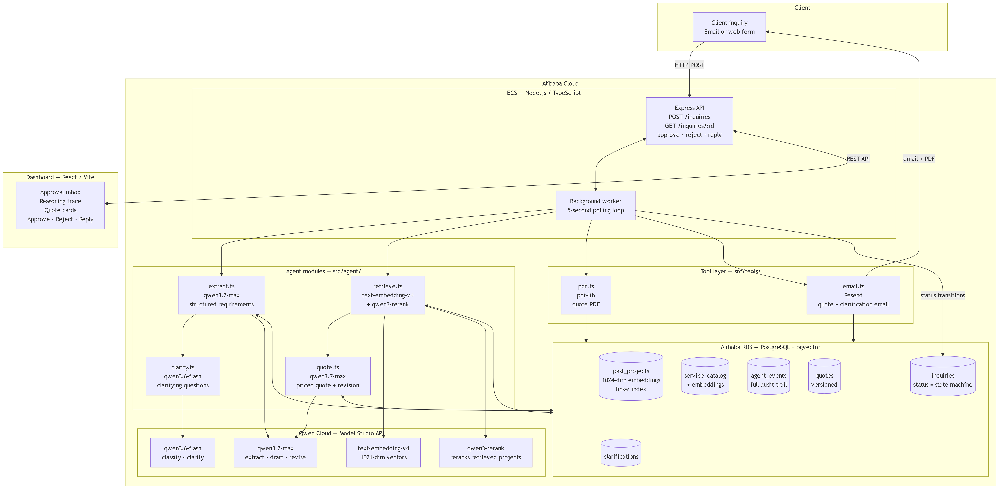

# QuotePilot

## Environment

| Variable | Default | Purpose |
| --- | --- | --- |
| `PUBLIC_BASE_URL` | `http://localhost:3001` | Base URL used to build the public link to a generated quote PDF (served from `/files`). |
| `RESEND_API_KEY` | _(none)_ | Resend API key for sending real emails. If unset, `sendEmail` logs a stub line and the pipeline keeps running. |
| `FROM_EMAIL` | `QuotePilot <onboarding@resend.dev>` | The "from" address used when sending email via Resend. |
| `BOOKING_URL` | `#` | Link included in the quote email inviting the client to book a call. |

## Architecture
